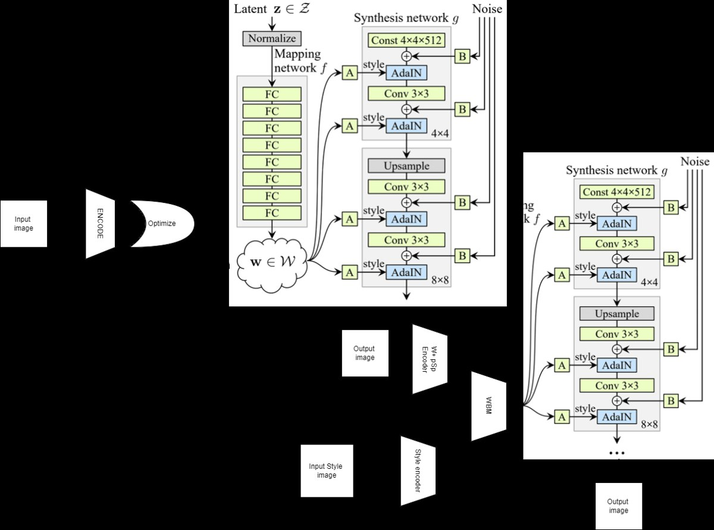
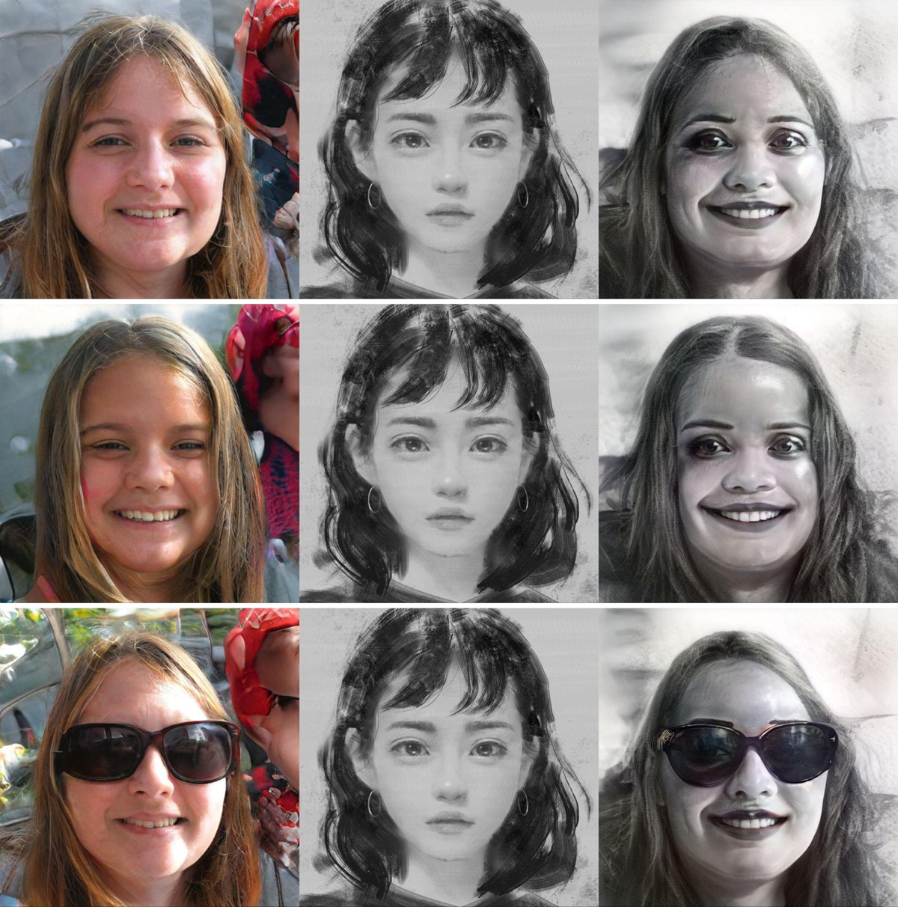
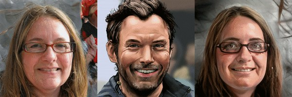
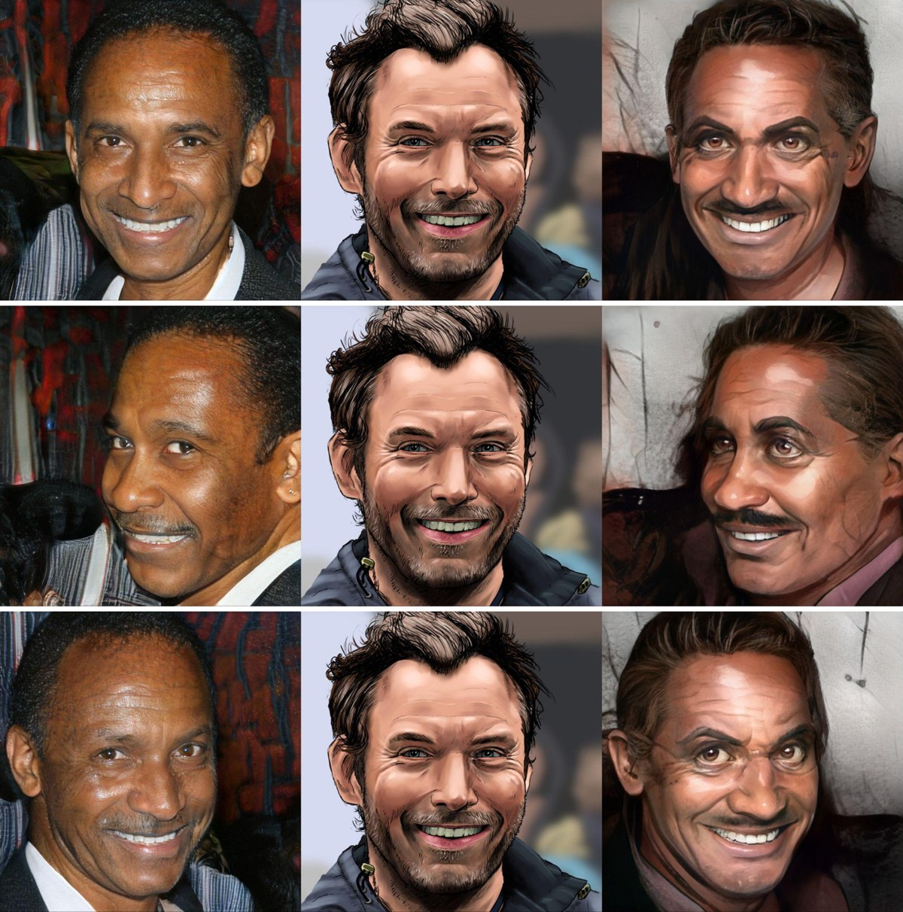
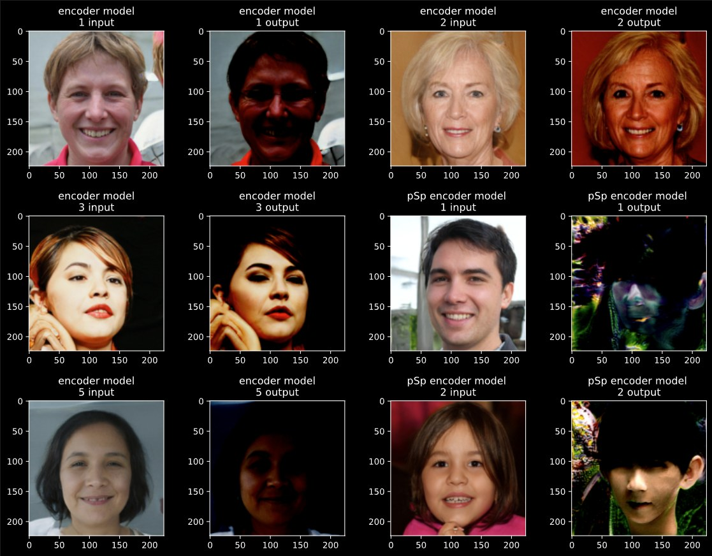

# Edit, then stylise: InterFaceGAN × BlendGAN

Semantic face editing in a GAN's latent space, followed by artistic stylisation of the edited
face. **InterFaceGAN** (Shen et al., CVPR 2020) supplies the editing directions (age, glasses,
gender, smile, pose) in StyleGAN's latent space; **BlendGAN** (Liu et al., NeurIPS 2021) turns
the edited portrait into a given art style from a single reference image. The project studies
how well BlendGAN preserves the edited attributes, and compares three ways of getting a real
photograph into the editable latent space in the first place.

Sabancı University graduate course project, 2022, with Ali Osman Berk Şapcı and Cem Kaya.
**[Full report (PDF, 10 pages)](docs/report_2022.pdf).** The experiments ran on the upstream
implementations linked below; this repository holds the report, the result figures and the
method summary.



## What was done

1. **Attribute editing.** Sample a StyleGAN face, move its latent code along InterFaceGAN's
   pretrained boundary normals with weight ±2 per attribute (age, eyeglasses, gender, smile,
   head pose), and render every combination.
2. **Stylisation.** Feed each edited face and a reference style image to BlendGAN. Reference
   styles came from BlendGAN's AAHQ artistic-face test set and from comics (Hellboy, Watchmen).
3. **Real-photo inversion.** To edit a real photograph rather than a sampled face, the image
   must first be encoded into the latent space. Three approaches were compared:

| approach | how | outcome | time / image |
|---|---|---|---|
| 1 · trained encoder | ResNet-38 regressing W (1×512) from 50k image/latent pairs; pSp encoder on the 52k commercial FFHQ subset | semantically similar, not photo-realistic; pSp did not converge on an 8 GB GPU (3.2 h / epoch) | fast |
| 2 · latent optimisation | optimise a random W+ (18×512) code by back-propagating a reconstruction loss through the generator | high fidelity only with a good starting point | ~5 min |
| 3 · hybrid | encoder prediction as the starting point, then optimisation | photo-realistic, semantically close, **stable under editing**; identity not fully preserved | ~5 min |

## Results

**InterFaceGAN edits are robust across the useful range** (weights around ±2) and degrade
only at extreme weights; the report's Fig. 6 shows the sweeps for all five attributes.

**BlendGAN keeps the edit.** Same reference style, three edits of one sampled face: original,
younger, with eyeglasses. The stylised portrait follows each change.



One edited face, several reference styles:



**Pose survives stylisation.** Original, turned left, turned right, each with a comic-like
reference.



BlendGAN handled almost every AAHQ style; some comic references with busy backgrounds and
complex textures did not blend cleanly.

**Hybrid inversion (approach 3)** produced latent codes that stayed stable under editing: the
grid below is one inverted face edited across attribute combinations (eyeglasses, smile, pose)
without the artefacts that plain optimisation produced.



## Reproducing

The pipeline is built from two public repositories; the report records the settings used.

```bash
git clone https://github.com/genforce/interfacegan      # boundaries + StyleGAN editing
git clone https://github.com/onion-liu/BlendGAN          # stylisation, AAHQ test styles
# 1. sample or invert a face -> W / W+ code (see report §"Encoding for manipulation")
# 2. edit:   code + w * boundary_normal   for w in {-2, +2}, per attribute
# 3. render with StyleGAN, then run BlendGAN with a reference style image
```

## References

- Y. Shen, J. Gu, X. Tang, B. Zhou. *Interpreting the Latent Space of GANs for Semantic Face
  Editing.* CVPR 2020. [arXiv:1907.10786](https://arxiv.org/abs/1907.10786)
- Y. Shen, C. Yang, X. Tang, B. Zhou. *InterFaceGAN: Interpreting the Disentangled Face
  Representation Learned by GANs.* TPAMI 2020. [arXiv:2005.09635](https://arxiv.org/abs/2005.09635)
- M. Liu et al. *BlendGAN: Implicitly GAN Blending for Arbitrary Stylized Face Generation.*
  NeurIPS 2021. [arXiv:2110.11728](https://arxiv.org/abs/2110.11728)
- W. Xia et al. *GAN Inversion: A Survey.* [arXiv:2101.05278](https://arxiv.org/abs/2101.05278)
- E. Richardson et al. *Encoding in Style: a StyleGAN Encoder for Image-to-Image Translation
  (pSp).* CVPR 2021.

## License

Report and figures © the authors, 2022. Generated faces come from StyleGAN (FFHQ) and BlendGAN
(AAHQ) models under their respective licences.
