# Background

## Generative adversarial networks

GANs generate high-quality photo-realistic images by adversarial training between a generator
and a discriminator; that competition is the key to their success and the reason for the
attention they have received.

## BlendGAN

BlendGAN (Liu et al., 2021) generates stylised face images of high quality:

1. A style encoder learns a style code from a reference style image; the codes are normally
   distributed.
2. Two MLPs map the face code and the style code into separate spaces.
3. A weighted blending module (WBM) combines the two spaces and feeds the generator, which
   produces both natural and stylised faces.
4. Three discriminators judge realism: a face discriminator (real vs. generated natural face), a
   style discriminator (real vs. generated stylised face) and a style-latent discriminator
   (stylised face vs. its style code).

## InterFaceGAN

InterFaceGAN (Shen et al., 2020) turns an unconditionally trained face generator into a
controllable one:

1. Take a pretrained GAN and an attribute scorer.
2. Sample latent vectors, generate faces, score the attributes of interest.
3. Fit a linear SVM in latent space for each attribute; the normal of its separating hyperplane
   is the editing direction.
4. Edit a face by moving its latent code along that normal.

Because the best pretrained boundaries are for StyleGAN, there are several latent spaces
($\mathcal{Z}$, $\mathcal{W}$, $\mathcal{W}^+$) in which an image can be encoded.

# Problem

Semantically edit a given face using the latent space of a GAN, then stylise the edited face
for a given art style, and analyse the attribute-transfer capabilities of BlendGAN when it is
driven by InterFaceGAN edits.

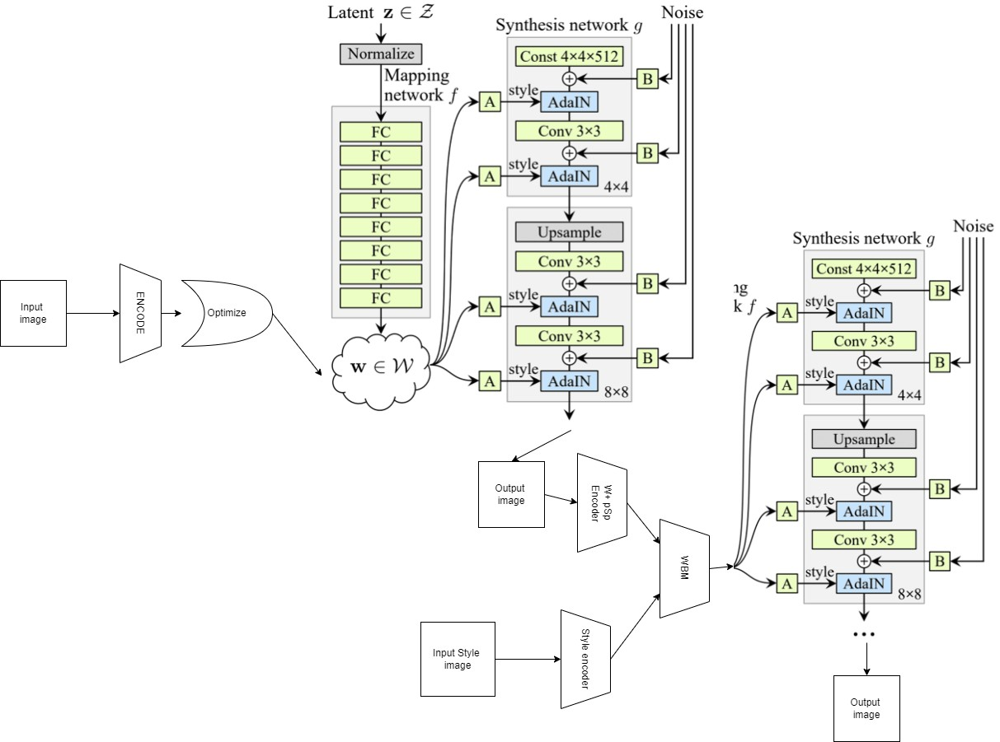{width=100%}

InterFaceGAN edits gender, age, expression, eyeglasses and head pose, and can also repair
artefacts in generated images. BlendGAN stylises the result from a reference image and lets us
draw on the AAHQ artistic-face dataset released with it.

# Encoding a photograph into the editable latent space

InterFaceGAN edits *sampled* faces well, but editing a real photograph needs GAN inversion
first. Following the taxonomy of Xia et al. (*GAN Inversion: A Survey*) we tried three routes.

## Approach 1: a trained encoder

A ResNet-38 was trained to regress the $\mathcal{W}$ code ($1 \times 512$) from 50\,000
image/latent pairs. Its reconstructions are semantically similar but neither photo-realistic
nor the same person. pSp encoders (pixel2style2pixel, which use the generator as the decoder
of an auto-encoder) were trained on the commercially usable portion of FFHQ (52\,000 images)
but did not converge within our budget: 3.2 hours per epoch at batch size 4 on an 8 GB GPU.

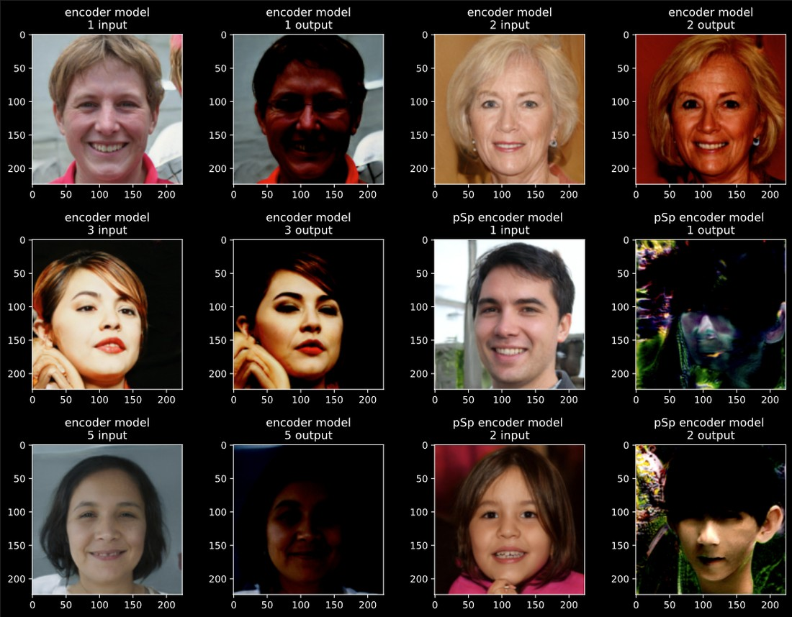{width=80%}

## Approach 2: latent optimisation

Start from a random $\mathcal{W}^+$ code ($18 \times 512$), which the survey shows can give
high-fidelity reconstructions, and optimise it by back-propagating a reconstruction loss through
the generator. Without a close starting point the results are not photo-realistic, and each
image takes about five minutes.

## Approach 3: hybrid

Use the encoder's prediction as the starting point and then optimise. This gave photo-realistic,
semantically close reconstructions. Identity is not fully preserved, but the resulting codes are
**stable under semantic editing**, which is not a given for every inversion method.

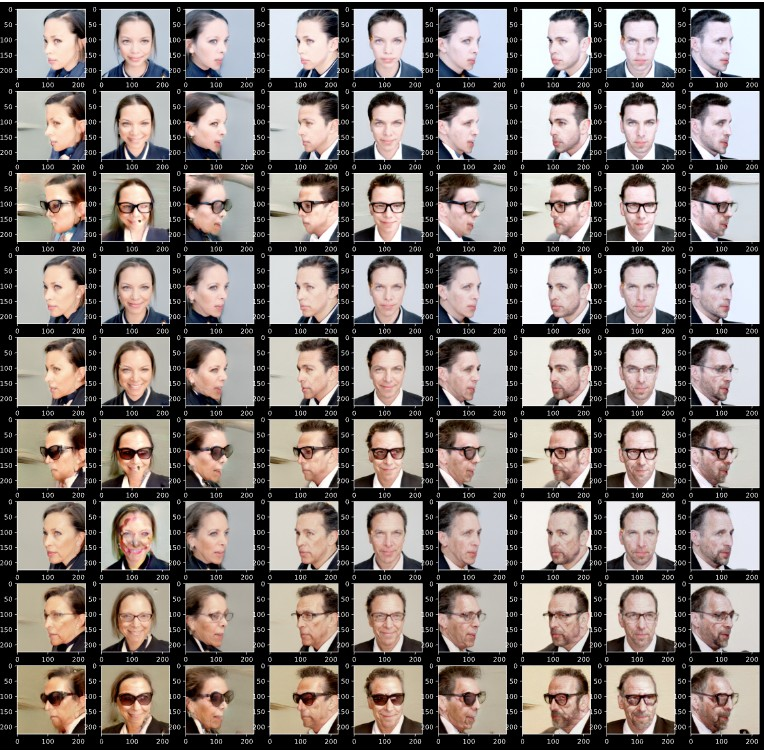{width=62%}

# Results

## Attribute editing

InterFaceGAN edits five attributes: age, eyeglasses, gender, smile and head pose. Sweeping
each weight from strongly negative to strongly positive shows robust edits across the useful
range and artefacts only at the extremes, as expected. The strips below sample seven points of
each sweep; the full animations are in the README.

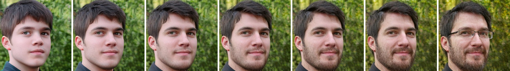{width=100%}
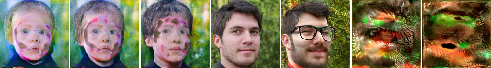{width=100%}
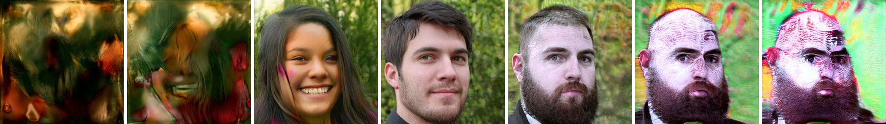{width=100%}
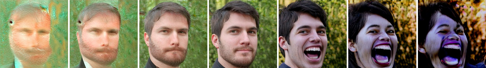{width=100%}
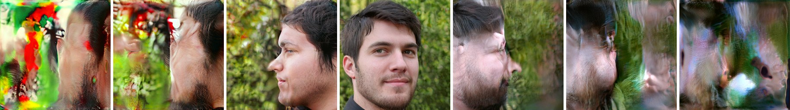{width=100%}

## Edit, then stylise

We sampled portraits, produced every combination of edited attributes with weights $\pm 2$,
and stylised each with BlendGAN. Reference styles came from the AAHQ test images shipped with
BlendGAN and from comics (Hellboy, Watchmen). BlendGAN handled almost every AAHQ style; a few
comic references with busy backgrounds and complex textures did not blend cleanly.

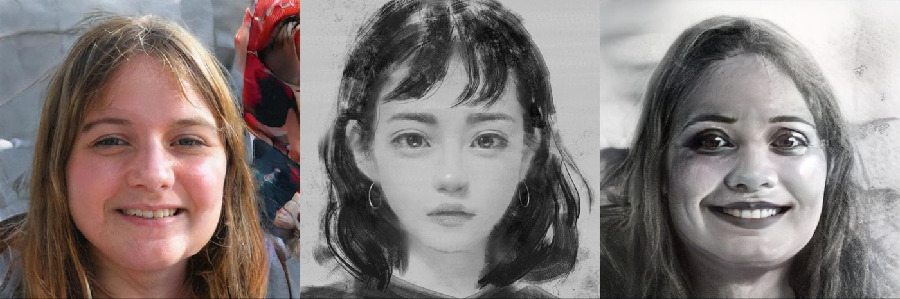{width=100%}
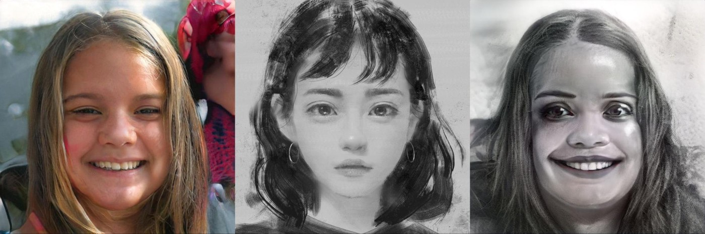{width=100%}
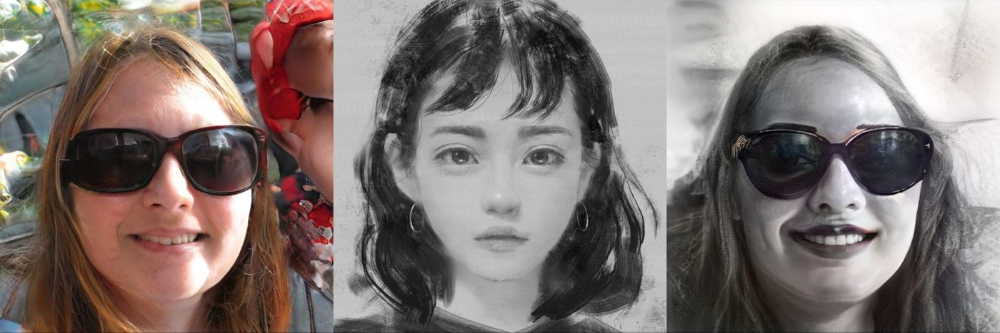{width=100%}

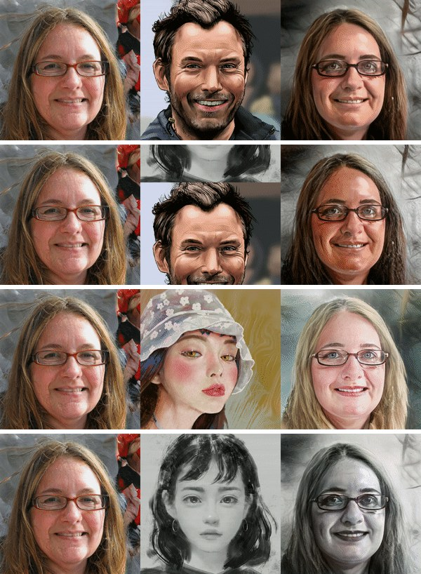{width=55%}

## Pose survives stylisation

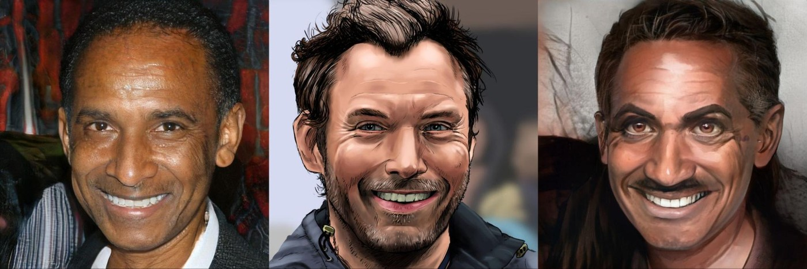{width=100%}
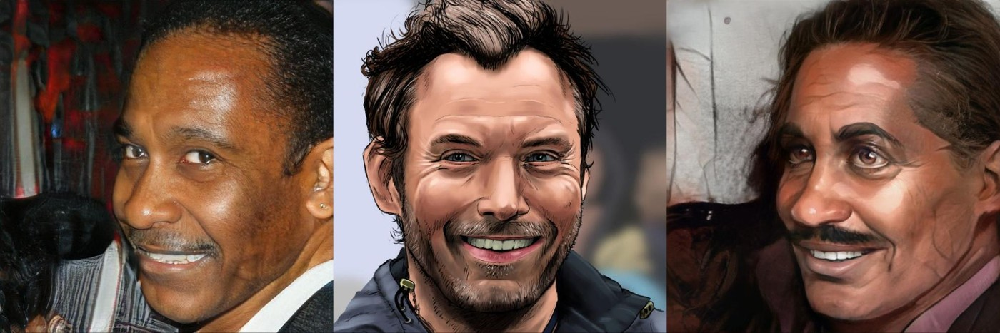{width=100%}
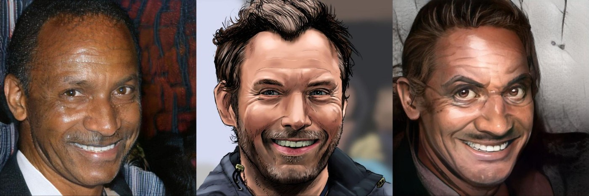{width=100%}

# Conclusion

GANs are effective for image manipulation and stylisation. For real-life use the limiting step
is inversion: of the three encoding approaches, the hybrid encoder-plus-optimisation route
performed best, at a cost of about five minutes per image and an encoder that is expensive to
train. Given an editable code, InterFaceGAN's edits are robust and BlendGAN preserves them
under stylisation across a wide range of reference styles.

# References

- Y. Shen, J. Gu, X. Tang, B. Zhou. *Interpreting the Latent Space of GANs for Semantic Face
  Editing.* CVPR 2020. arXiv:1907.10786.
- Y. Shen, C. Yang, X. Tang, B. Zhou. *InterFaceGAN: Interpreting the Disentangled Face
  Representation Learned by GANs.* TPAMI 2020. arXiv:2005.09635.
- M. Liu et al. *BlendGAN: Implicitly GAN Blending for Arbitrary Stylized Face Generation.*
  NeurIPS 2021. arXiv:2110.11728.
- W. Xia et al. *GAN Inversion: A Survey.* arXiv:2101.05278.
- E. Richardson et al. *Encoding in Style: a StyleGAN Encoder for Image-to-Image Translation.*
  CVPR 2021.
- Code used: github.com/genforce/interfacegan · github.com/onion-liu/BlendGAN.

*This PDF is typeset from the 2022 course report; the text is the original with light
copy-editing, and animated figures are replaced by frame strips.*
